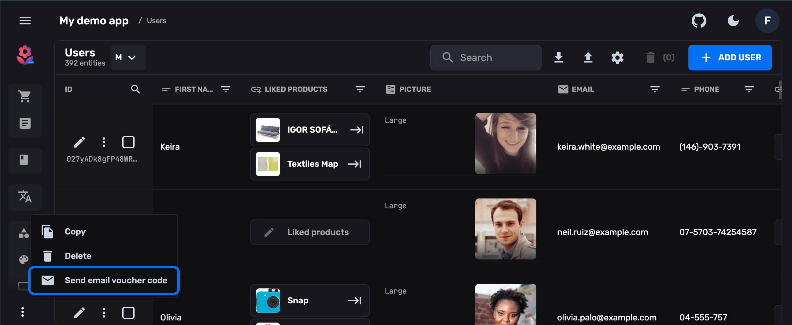

> FireCMS 3.0 is here and it is our biggest release so far.
>
> FireCMS is growing into what it was always meant to be for Firebase teams.
> 


When we started FireCMS, we wanted something very specific:

- A CMS that **understands Firestore** instead of fighting it.
- A tool that could be **handed over to non‑developers** without fear.
- A system that feels **fast, modern and customizable**, without drowning you
  in configuration.

Over the years, thousands of companies have used FireCMS to manage production
apps, internal tools, content websites, and everything in between. We have seen
teams replace spreadsheets, ad‑hoc admin panels, and heavy traditional CMSs with
something that feels light but powerful.

FireCMS 3.0 is the version where all that experience is baked into the product.

It is not just a new major version number. It is:

- A **new backend** that unlocks safer collaboration and smarter features.
- A fully rebuilt **Tailwind‑based UI** with our own component library.
- A new **schema editor, data inference and import/export** flow that makes it
  easier than ever to get started and to grow.
- A **new authentication system**, better user management and countless
  day‑to‑day UX improvements.

But more importantly: 3.0 doubles down on what makes FireCMS special.

<!-- truncate -->

## Why FireCMS in 2025?

There are a lot of CMS options out there. Many of them are great.

FireCMS is different because it is **deeply opinionated around Firebase and
Firestore**, and around the kind of teams that build with them.

If you are:

- Building a product with **Firebase as your backend** (or thinking about it).
- Tired of boilerplate admin panels and home‑grown tools.
- Looking for a CMS that can be **extended in code** but still feels friendly to
  non‑technical users.

Then FireCMS is designed for you.

### Built to match Firestore, not to abstract it away

From day one, we embraced the way Firestore works:

- Collections, documents and subcollections map directly to how you navigate
  the UI.
- References, arrays, maps and nested structures are not edge cases, they are
  first‑class citizens.
- Realtime updates, security rules and permissions all influence how the CMS is
  shaped.

Instead of forcing Firestore into a generic CMS data model, FireCMS leans into
it. That is why teams often tell us they can "think in Firestore" while using
FireCMS.

### Thousands of teams, many unexpected use cases

We originally built FireCMS to scratch our own itch at our development agency.
Today, it powers use cases we never imagined:


- Internal tools for logistics, inventory, content operations.
- Multi‑tenant SaaS products where clients get their own tailored CMS.
- Content sites and documentation portals with custom workflows.

This diversity pushed us to keep the **core extremely flexible** while providing
strong defaults. FireCMS 3.0 is our answer to years of feedback from those
projects.

## Custom‑built instead of glued together

A lot of admin panels are a thin layer of glue on top of a pile of UI libraries
and generic table components.

With FireCMS 3.0 we have doubled down on building **our own primitives**:

- A **table and form system** that understands collections, nested objects,
  references and validation.
- A component library, [`@firecms/ui`](https://www.npmjs.com/package/@firecms/ui),
  designed specifically for the flows you see in a CMS: filters, bulk actions,
  dialogs, drawers, side panels, history timelines, etc.
- A **history plugin**, local change tracking and diff views crafted for content
  workflows, not just CRUD.
- And more, including drag‑and‑drop ordering, image compression, and
  import/export flows.

We still stand on the shoulders of great tools (React, Tailwind, Radix UI…), but
we design the blocks ourselves so we can:

- Keep the experience cohesive and focused.
- Optimize aggressively for performance.
- Expose the same building blocks to you when you need to go further.

If you want to build your own views, you can import `@firecms/ui` and reuse the
same components we use internally.

```bash
npm install @firecms/ui
# or
yarn add @firecms/ui
```


## A better fit for real teams: Cloud, PRO and Community

Different teams need different levels of control. With FireCMS 3.0, we now have
three flavors, all sharing the same foundations.

### FireCMS Cloud: hosted, collaborative, Firebase‑first

FireCMS Cloud is the easiest way to start: connect it to your Firebase project
and you get a fully hosted CMS with a **dedicated backend**.

Until now, FireCMS was a frontend‑only library talking directly to Firebase
client SDKs. It worked very well for simple cases, but it had some natural
limits:

- You could not safely let non‑developers edit collection schemas.
- Configuration lived in code and in Git, not where your content team works.
- Advanced features (like data enhancement) were harder to provide.

With the new Cloud version we can:

- Store **schema and configuration in Firestore**, carefully separated from your
  application data.
- Let end users **edit schemas from the UI**
  (with granular control over what can be changed).
- Offer additional features such as **data enhancement powered by OpenAI and
  Google models**.

You keep your Firebase project, we add the opinionated layer on top.


### FireCMS PRO: self‑hosted power

FireCMS PRO is for teams that need all the advanced features, but need to own the
infrastructure:

- You host the backend.
- You keep full control over data residency and compliance.
- You get the most powerful way to customize every layer of FireCMS.

It is especially well‑suited for agencies that want to offer a CMS as a product
for their clients, or for teams that need a higher degree of customization and
control.

### FireCMS Community: open source core

The Community edition remains **MIT‑licensed and self‑hostable**.

It includes the full feature set of FireCMS 2.0 plus many of the **UI and
performance improvements** of 3.0. For many projects, this is more than enough
and a great way to start.

## Making schemas less scary

Content models are usually where CMS projects slow down. They tend to be:

- Hard‑coded in codebases.
- Opaque to non‑developers.
- Painful to evolve once content exists.

With 3.0 we wanted schemas to feel much more approachable, without losing the
precision developers need.


### Visual schema editor

In FireCMS Cloud and PRO, schemas can live in the backend. That unlocks a
**visual, UI‑first schema editor**:


- Add and edit fields from the admin.
- Use suggestions based on existing data to grow your enums.
- Decide per field what is editable from the UI and what stays locked to code.

You can still define everything in TypeScript if that's your style, but now you
can safely hand over some changes to your team.

### Data inference: start from what you already have

If you already have collections in production, you don’t have to start from a
blank page.

FireCMS 3.0 can **infer schemas from your existing data**, giving you:

- A first draft of your content model in minutes.
- A concrete starting point you can refine instead of inventing fields from
  scratch.


## Working with your data should feel effortless

We see FireCMS as the control center for your Firebase project. That means
search, imports, exports and edits need to feel natural.

<video class="demo" loop autoplay muted width="100%">
  <source src="/img/editor_rectangle.mp4" type="video/mp4"/>
</video>

### Notion‑style editor for rich content

A lot of content in real projects is more than plain text: long articles,
product descriptions, FAQs, marketing pages. For that kind of work, you want an
editor that feels as comfortable as writing in Notion.

In FireCMS 3.0, rich text editing has been reimagined around a **Notion‑like
experience**:

- A clean, focused canvas where content comes first.
- Slash commands to insert blocks, media and structure without taking your
  hands off the keyboard.
- Fast keyboard navigation and a suggestion menu that stays out of the way
  until you need it.

It is built on modern editor technology, but the goal is simple: make long‑form
content editing inside FireCMS feel natural enough that your team forgets they
are using an admin tool.

### Local search without extra services

For small and medium projects, wiring up an external search engine can feel like
unnecessary overhead.

FireCMS 3.0 adds **local text‑based search**:

- Search directly inside the CMS without provisioning Algolia or Elastic.
- Keep costs predictable while you iterate.

When your dataset grows, you can still upgrade to an external search provider
and keep using FireCMS as the UI.

<video class="demo" loop autoplay muted width="100%">
  <source src="/img/import.mp4" type="video/mp4"/>
</video>

### Import and export that respects your model

We rebuilt import/export around real‑world flows:

- Export as **JSON or CSV** with control over date formats and arrays.
- Import from **CSV, JSON or Excel**, mapping columns to fields in a modern UI.
- See how data will be interpreted before committing anything.

This makes migrations from old systems, spreadsheets or other CMSs much less
painful.

## A new UI, a new logo, and a faster experience

Versions 1.x and 2.x of FireCMS used Material UI. It helped us move fast early
on, but it also meant runtime styling and heavier bundles.

In FireCMS 3.0 we rebuilt the UI on **Tailwind CSS** and our own component
library:

- Styles are generated at build time, so the browser has much less work to do.
- The CSS bundle is smaller and more focused.
- The whole CMS feels **snappier, more consistent and more modern**.

We also took the opportunity to **refresh our visual identity**:

- A **new logo** that better represents FireCMS today.
- A redesigned **landing page** aligned with the product experience.

The goal is simple: FireCMS should feel as good to use as the products you’re
building with it.

## Authentication, permissions and users that make sense

Admin tools live and die by how well they handle access.

FireCMS 3.0 introduces a new authentication system focused on **CMS users and
roles**:

- Manage CMS users from the UI.
- Assign roles and permissions without touching code.
- Still define fine‑grained rules in code where needed.

In self‑hosted setups we have also refined how we track user identifiers to
better support setups where you mix SaaS accounts, Firebase users and external
systems.

## Small improvements, big impact

Finally, 3.0 comes with a long list of quality‑of‑life updates that you might
not notice individually, but that you definitely feel together:

- Smoother editors and forms, with better error focus and pre‑save validation.
- Inline editing directly in collection views with more predictable behavior.
- Local change tracking you can enable, disable or fine‑tune to your needs.
- New image resizing and compression behind the scenes, so uploads behave the
  way you expect.
- Dozens of small UI tweaks: dialogs, buttons, table cells and labels that just
  feel more polished.

All this sits on top of a big internal refactor that makes FireCMS easier to
maintain and extend—both for us and for you if you are building on top of it.

## Where to go from here

If you are new to FireCMS, the easiest way to start is:

1. Spin up **FireCMS Cloud** and connect it to a Firebase project.
2. Let it **infer your schemas** or start from a simple hand‑written one.
3. Invite a teammate and experiment with the **schema editor**, **search**, and
   **import/export** tools.

If you are already using FireCMS 2.x, check out
[What’s new in FireCMS 3.0](/docs/what_is_new_v3) for a more detailed breakdown
of the changes.

And if you are an agency or a team that needs more control, you can always
[book a demo of FireCMS PRO](https://calendar.google.com/calendar/u/0/appointments/schedules/AcZssZ0INW8ihjQ90S4gkdo8_rbL_Zx7gagZShLIpHyW43zDXkQDPole6a1coo1sT2O6Gl05X8lxFDlp?gv=true)
to see what a self‑hosted setup looks like.

## Thank you

FireCMS 3.0 is the sum of many bug reports, feature requests, emails, Discord
messages and PRs.

If you are already using FireCMS, thank you for trusting it with your projects.
If you are just discovering it now, we hope this release makes it clear what we
are aiming for: **the best possible CMS for Firebase‑powered products**.

We are excited to see what you build next.
