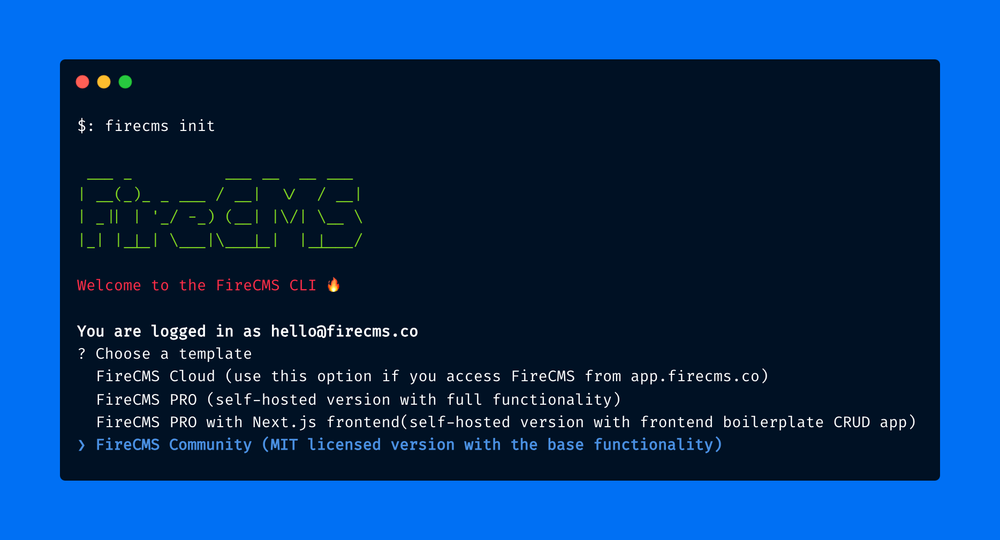

## Kickstart a new project with FireCMS in a single command

When was the last time you started a new project using a new tool? Can you remember how easy it was?

We are eager to help you start a new project as soon as possible. We want you to fully focus on your project and not on the setup. Allow us to take care of that; all you need to do is:

```bash
firecms init
```

That's it! You are ready to go. You can now start building your project with [FireCMS](https://firecms.co).

### FireCMS Flavors

If you are familiar with FireCMS, you must already know the [different flavors](https://firecms.co/pricing) we offer: **Community**, **Cloud**, or **Pro**. Or maybe we just confused you a little in the past. No worries, let's recap.

#### Community

The **classic** old-fashioned MIT licensed **FireCMS**. You can use it for free, forever. It's the **perfect** choice for **small projects** or personal use. You handle the hosting; we handle the CMS. Create collections, add authentication, set it up, and after a working build, deploy it to Firebase Hosting or the hosting of your choice.

Batteries included for Firebase **Firestore** and **MongoDB** Atlas. Add more than 40 UI components, a custom view, and even our Notion-style Markdown editor. You can **customize** the CMS to **your needs**.

If you've been here for a while and you are 100% sure this is your choice, don't be shy and start a new project with:

```bash
firecms init --community
```

#### Cloud

The **supercharged** SaaS version of **FireCMS**. The amazing editor. And on top of it, add user management, roles, permissions, a UI-based collection editor, search, autocomplete based on LLMs, customization, App Check, multiple database support, unlimited collections, users, extra customization with code... And the list could go on for a while.

<!-- truncate -->

Most importantly, you **don't** need to **worry** about **hosting, scaling, security, or maintenance**. We take care of it. You just need to focus on your project. If you need to add more features or customize, send us the code via the CLI.

We expect this CLI to be less used than the Community one, but if you want to do some work from the code, it is up to you. We truly hope that the tools we've been building on [app.firecms.co](https://app.firecms.co) will be your main tool.

#### Pro

The **ultimate** version of **FireCMS**. The Cloud version with a custom domain, custom branding, and priority support.

Pro gives you both the blueprint and the fully-furnished building — **complete control** over the foundation like Community, plus all the **premium features** of Cloud. With full access to the source code, you can customize every aspect of your CMS while leveraging **enterprise-grade capabilities**.

What can you expect? A schema editor and data inference, advanced data import and export, Notion-style editor, local text search, user and role management, custom authentication and access control, access to all FireCMS plugins, full CMS components customization, priority support, and roadmap prioritization.

#### Flavors compared

Who doesn't like a good comparison table? Here is a quick overview of the features you get with each flavor:

| Feature                                | Community | [Cloud](https://app.firecms.co) | Pro |
|----------------------------------------|-----------|---------------------------------|-----|
| **Pricing**                            | Free (€0/month) | €9.99/user/month                | €49.99/project/month |
| **License**                            | MIT | Commercial                      | Commercial |
| **Hosting Model**                      | Self-hosted | Fully managed                   | Self-hosted |
| **Base Features**                      |
| Firebase/MongoDB Integration           | ✅ | ✅                               | ✅ |
| Component Library (40+ components)     | ✅ | ✅                               | ✅ |
| Custom Views and Form Fields           | ✅ | ✅                               | ✅ |
| Notion-style Markdown Editor           | ✅ | ✅                               | ✅ |
| Subcollection Support                  | ✅ | ✅                               | ✅ |
| **Advanced Features**                  |
| Custom Domain                          | ✅ | ❌                               | ✅ |
| Custom Login Screen                    | ✅ | ❌                               | ✅ |
| Custom Authentication & Access Control | ✅ | ❌                               | ✅ |
| Data Import/Export                     | ❌ | ✅                               | ✅ |
| User & Role Management                 | ❌ | ✅                               | ✅ |
| AI Content Generation                  | ❌ | ✅                               | ✅ |
| Schema Editor & Data Inference         | ❌ | ✅                               | ✅ |
| Advanced Data Import/Export            | ❌ | ❌                               | ✅ |
| Access to All FireCMS Plugins          | ❌ | ❌                               | ✅ |

### Installation

If this is your first time using FireCMS, you need to install it first. You have two choices: either you install the FireCMS CLI globally with your desired package manager:
```bash
npm install -g firecms
# yarn fan?
yarn global add firecms
# pnpm? Sure!
pnpm add -g firecms
```

### Usage without installation via npx

Of course, if you'd rather not install it globally, you can use npx to run a one-off command:

```bash
npx firecms init
```

### Usage

Ok, let's get back to the CLI. You've already installed it, right? Now you can start a new project with FireCMS. Just run:

```bash
marian@m ~ % firecms init

 ___ _          ___ __  __ ___
| __(_)_ _ ___ / __|  \/  / __|
| _|| | '_/ -_) (__| |\/| \__ \
|_| |_|_| \___|\___|_|  |_|___/

Welcome to the FireCMS CLI 🔥

You are logged in as hello@example.com
? Choose a template
  FireCMS Cloud (use this option if you access FireCMS from app.firecms.co)
❯ FireCMS PRO (self-hosted version with full functionality)
  FireCMS PRO with Next.js frontend(self-hosted version with frontend boilerplate CRUD app)
  FireCMS Community (MIT licensed version with base functionality)
```

After carefully choosing the flavor you want to use, you will get a new project with FireCMS. Completely set up and ready to go.

One of the reasons we need to authenticate you is the creation of the Firebase project configuration automatically. We want to make sure you have the best experience possible.

After the project is created, you can start the development server with:

```bash
cd my-latest-firecms-project
npm i
npm run dev
```

So we basically did the following for you:
- Helped you choose the proper Firebase Project
- Created the Firebase Hosting App Project
- Created the Firebase Config file
- Got the proper template for the project with the appropriate flavor
- Set up the project

### Troubleshooting

### Problems with the Login/Logout?

If you have any problems with login/logout, you can always run the following command to reset the authentication:

```bash
firecms logout
```

If the issue persists, you can try to delete all the config folders and files:

```bash
rm -rf ~/.firecms
```

### Upgrading the CLI

If you want to upgrade the CLI to the latest version, you can run:

```bash
npm install -g firecms@latest
```

### Other issues and feedback

Drop us an email at [hello@firecms.co](mailto:hello@firecms.co) or even better, join our [Discord server](https://discord.gg/fxy7xsQm3m) and let us know about your issue. We are always happy to help.

### Conclusion

We hope the new FireCMS CLI brings you joy and saves you time.

We are excited to see what you build next. We are eager to help you start a new project as soon as possible.
